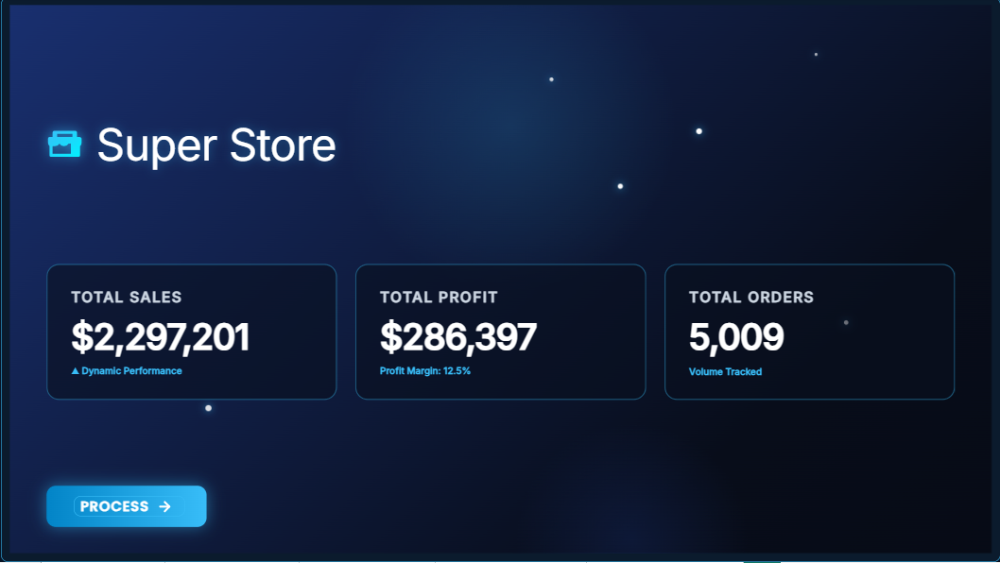
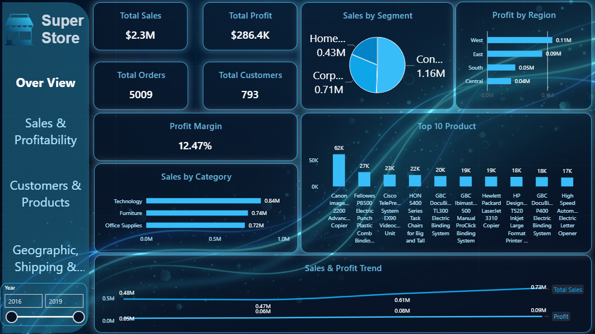
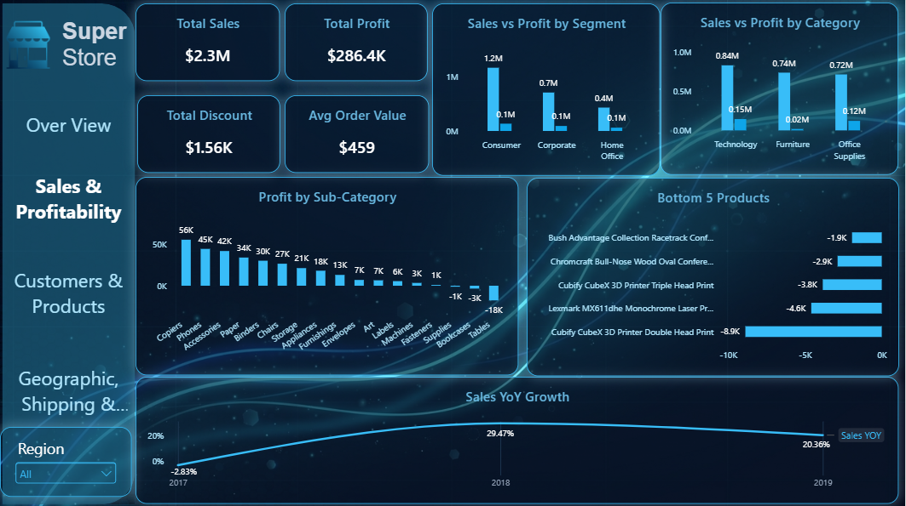
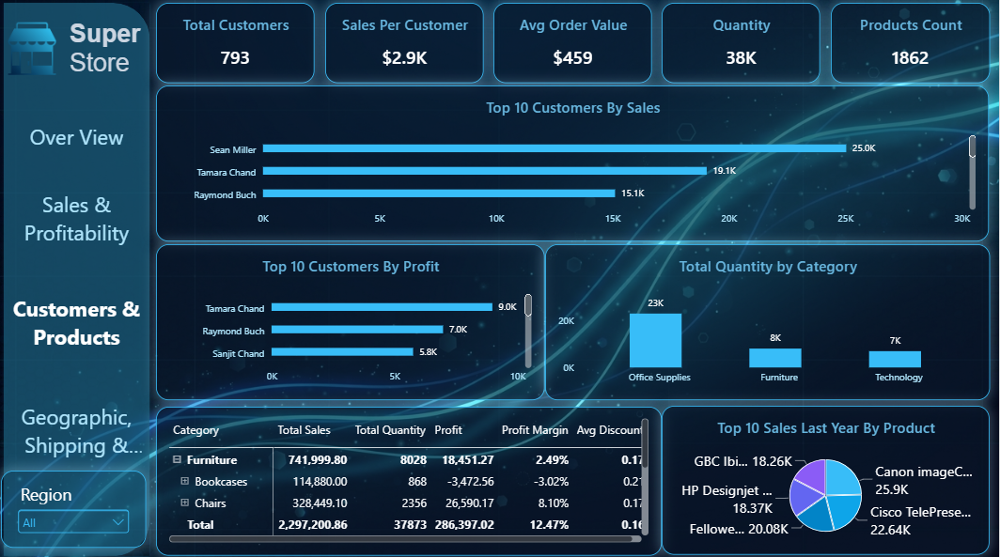
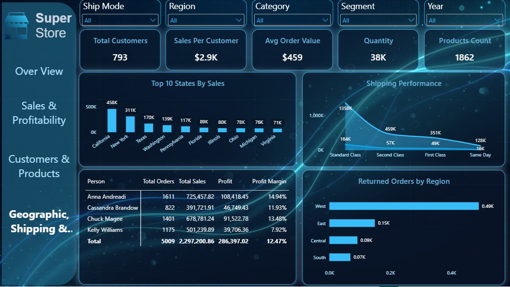

#  SuperStore Sales & Business Analytics Dashboard

An interactive **Power BI dashboard** designed to analyze SuperStore sales performance, profitability, customers, products, geographic performance, and shipping operations.


---

##  Project Overview

The **SuperStore Dashboard** provides a multi-page analytical view of the business, combining key performance indicators, interactive visualizations, and business-focused analysis.

The project focuses on answering questions such as:

- How are sales and profit performing?
- Which products and categories generate the most sales?
- Which customer segments contribute the most revenue?
- Which regions perform best?
- How profitable is the business?
- How does shipping performance vary across the business?

---

##  Business Objectives

- Monitor overall sales and profitability.
- Track important business KPIs.
- Analyze product and category performance.
- Understand customer segment behavior.
- Compare regional performance.
- Analyze shipping and return-related performance.
- Identify high-performing products and business areas.
- Support data-driven decision making.

---

##  Dashboard Pages

### 1.  Landing Page

A visually designed landing page providing navigation between the different analytical sections.

### 2.  Executive Overview

Provides a high-level summary of business performance.

**Key KPIs:**

- Total Sales
- Total Profit
- Total Orders
- Profit Margin

### 3.  Sales & Profitability

Focuses on analyzing sales performance and profitability, helping identify strong and weak-performing business areas.

### 4.  Customers & Products

Provides deeper analysis of customers and products, including sales contribution and product-level performance.

### 5.  Geographic & Shipping

Analyzes regional performance, shipping operations, and returns to provide a broader view of business performance.

---

##  Key Performance Indicators

| KPI | Description |
|---|---|
| **Total Sales** | Overall revenue generated |
| **Total Profit** | Overall profit generated |
| **Total Orders** | Number of distinct orders |
| **Profit Margin** | Profitability relative to sales |

---

##  Tools & Technologies

- **Microsoft Power BI Desktop**
- **DAX**
- **Power Query**
- **Data Modeling**
- **Data Visualization**
- **Business Intelligence**

---

##  Data Analysis Techniques

- Data cleaning and transformation
- Data modeling
- Table relationships
- DAX measures
- KPI development
- Top N analysis
- Interactive filtering
- Slicers
- Dashboard navigation
- Business-oriented data visualization

---

##  Dashboard Features

- Interactive dashboard navigation
- KPI cards
- Interactive filters and slicers
- Top 10 product analysis
- Category and segment analysis
- Regional analysis
- Profitability analysis
- Shipping analysis
- Returns analysis
- Custom dashboard design

---

##  Dashboard Preview

### Executive Overview


### Sales & Profitability


### Customers & Products


### Geographic & Shipping


---

##  Installation & Setup

### Prerequisites

Before opening the project, make sure you have:

- **Microsoft Power BI Desktop** installed on your computer.
- A Windows environment capable of running Power BI Desktop.

### Steps

1. **Clone or download this repository.**

2. Open the project folder and locate:

   ```text
   SuperStore_Dashboard.pbix
   ```

3. Open the `.pbix` file using **Microsoft Power BI Desktop**.

4. If Power BI prompts you about data sources or credentials, follow the prompts to reconnect or refresh the data source.

5. Once the file is open, click **Refresh** if necessary to update the data.

6. Use the dashboard navigation buttons, filters, and slicers to explore the analysis.

> **Note:** The `.pbix` file is intended to be opened with **Power BI Desktop**. You do not need to install Python, SQL Server, or any additional programming environment to view the dashboard.

---

##  Project Structure

```text
SuperStore-PowerBI-Dashboard/
│
├── SuperStore_Dashboard.pbix
│
├── README.md
│
└── Screenshots/
    ├── Executive_Overview.png
    ├── Sales_Profitability.png
    ├── Customers_Products.png
    └── Geographic_Shipping.png
```

---

##  Business Insights

The dashboard is designed to help stakeholders identify:

- Best-performing products and categories
- High-value customer segments
- Strong and weak geographic regions
- Sales versus profitability performance
- Potential shipping and operational issues
- Areas requiring further investigation

> The dashboard focuses on turning business data into actionable insights rather than simply displaying numbers.

---

## 👨 Author

**Omar Mosaad**

Data Analytics & Data Science Enthusiast

**Skills demonstrated:**

`Power BI` · `DAX` · `Power Query` · `Data Modeling` · `Data Visualization` · `Business Analysis`

---

##  Project Purpose

This project was developed as part of my journey in **Data Analytics and Data Science**, with a focus on building practical Power BI solutions and connecting data analysis with real business questions.

If you find this project useful, feel free to ⭐ the repository.